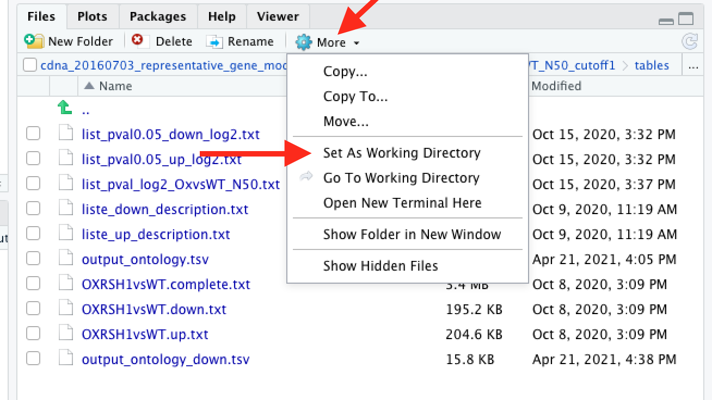
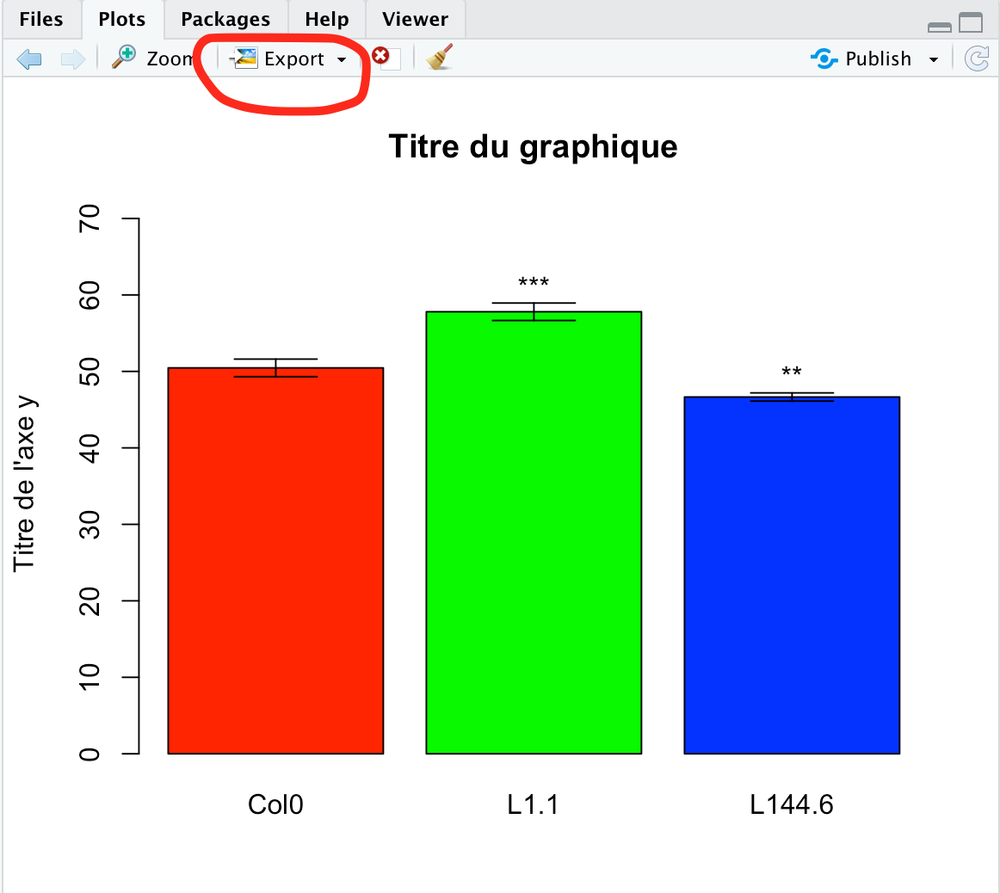

# Statistiques de base sur données en colonnes

Le script `script_norm_graph.R` est un script générique qui :

- Réalise les statistiques déscriptives des données
- Représente la distribution sous la forme d'un box plot
- Calcule la déviation standard

- Détermine la distribution des données (parmétriques ou non paramétriques)
- Fait les tests statistiques adaptés (Test de student ou Kruskal-Wallis + Dunn)
- Représente les données sous la forme d'un bar plot de la moyenne avec barres d'erreur et étoile pour la significativité. Si les données sont non paramétrique, la médiane est ajoutée au graphique.

## Structure des données

Les données doivent être au format `.txt` ou `.xlsx ` et  comporter n colonnes. Chaque colonne contient la valeur mesurée pour une lignée. Il ne doit pas y avoir de colonne de n° d'individus. Il est préférable d'avoir des noms de lignées qui commance par une lettre; Dans le cas contraire, R ajoutera un `X` au nom de la colonne. Pour éviter cela vous pouvez ajouter un `L` pour lignée deavnt le nom ou alors modifier les noms de colonnes après chargement des données en utilisant le commande suivante :

```R
colnames(df) <- c("nom de la lignée 1", "nom de la lignée 2", ...."nom de la lignée n")
```

Exemple :

| Lignée 1 | Lignée 2 | Lignée 3 | Lignée ... | Lignée n |
| -------- | -------- | -------- | ---------- | -------- |
| 55.8     | 57.0     | 47.1     | ....       | ....     |
| 44.3     | 62.0     | 46.2     | ....       | ....     |
| 47.5     | 66.3     | 44.3     | ....       | ....     |

## Initialisation des variables

C'est la partie du script qu'il faut modifier à chaque fois pour personnaliser l'analyse.

- Choix du répertoire de travail

```R
setwd("~/PATH/TO/DIRECTORY") 
```

Le répertoire de travail peut être sélectionner graphiquement dans l'onglet `Files` du cadre en bas à droite de l'interface R-studio.



- Choix du fichier à analyser

    On donne à la variable `DATA` le nom du fichier qui contient les données

```R
DATA <- "your_data_file.txt"
```

- Personnalisation du boxplot

    - Titres des axes

        ```R
        BOXPLOT_Xaxis <- "Titre de l'axe x"
        BOXPLOT_Yaxis <- "Titre de l'axe y"
        ```

    - Titre du graphique

        ```R
        BOXPLOT_TITLE <- "Titre du graphique"
        ```

- Personnalisation du Barplot

    - Titre du graphique

        ```R
        BAR_TITLE <- "Titre du graphique"
        ```

    - Titre de l'axe Y

        ```R
        BAR_Yaxis <- "Titre de l'axe y"
        ```

Pour les variables de personnalisation des graphique, si l'on ne souhaite pas faire apparaitre un titre il suffit de laisser l'interval entre les guillemet vide : `""`.

## Installation et appel des packages nécessaire

Deux packages sont nécessaire pour cette analyse afin de réaliser le test de Dunn et le chargement des données à partir d'un fichier `xlsx`, toutes les autres fonctions font appel au package R-base qui est chargé par défaut.

```R
if (!require(DescTools)) { install.packages("DescTools") }
if (!require(readxl)) { install.packages("readxl") }

library(DescTools) # Pour le test de Dunn
library(readxl) # Pour charger les données au format excel
```

## Fonctions utilisées dans le script

```R
#=========================================================================================
# Réalise le test de Student sur les données contenue dans le dataframe df
#=========================================================================================
student.test <- function (df) {
  # Crée un data frame pour stocker les pvalue du test de student
  pval <- data.frame()
  # Réalise le test de student sur chaque colonne de df en utilisant la première colonne comme référence
  for (i in 2 : ncol(df)) {
    pval[i,1] <- as.data.frame(t.test(df[,1], df[,i], alternative = "two.sided")$p.value)
  }
  # Nomme colonnes et lignes du dataframe pval
  colnames(pval) <- c("pvalue")
  rownames(pval) <- colnames(df)
  pval$padjust <- p.adjust(pval$pvalue, method = "BH", n = length(pval$pvalue))
  # Renvoie le resultat du test de Student sous la forme d'un dataframe
  return(pval)
}
#=========================================================================================

#=========================================================================================
# Identifie la plus grande valeur du jeu de donnée pour établir la hauteur de l'axe y
#=========================================================================================

maximum_y <- function () {
  ymax <- max (as.numeric(resume[4,]) + sd_df$SD)
}
#=========================================================================================

#=========================================================================================
# Crée un Barplot représentant les moyennes des données contenues dans df
#=========================================================================================
# La fonction prend en paramètre le titre principal du graphique et le titre de l'axe y
graph.norm <- function(titre_graph, titre_axe_y, couleur = rainbow(ncol(df))) {
  ymax <- max (as.numeric(resume[4,]) + sd_df$SD)        
  # Dessine le barplot
  plot <- barplot(c(as.numeric(resume[4, ])),
                  col = couleur,
                  ylim = c(0, ymax + ymax*0.2),
                  main = titre_graph,
                  ylab = titre_axe_y,
                  names.arg = colnames(df)
  )
  # Ajout des barres d'erreurs : en vérité des fléches à double pointe (code=3) et pointes horizontales (angle = 90)
  arrows(plot[,1], as.numeric(resume[4,]) - sd_df$SD, plot[,1], as.numeric(resume[4,]) + sd_df$SD, angle = 90, code = 3)
  return(plot)
}
#=========================================================================================

#=========================================================================================
# Positonne les étoiles de significativité dans le cas des données normales
#=========================================================================================
star_norm <- function() {
  for (i in 1 : ncol(df)) {
    x.star <- mean(plot[i, 1])      #permet de sélectionner la colonne voulu dans le plot
    y.star <- ymax*0.05 + (as.numeric(resume[4, i]) + sd_df[i, 1])    #position en y des étoiles 5% du ymax au dessus de la barre d'erreur de chaque colonne
    # Signif. codes: 0 ‘***’ 0.001 ‘**’ 0.01 ‘*’ 0.05 ‘.’ 0.1 ‘ ’ 1
    star = ""
    if (is.na(pval[i,2])) {                        # test le cas ou la pvalue n'est pas calculée (Na)
      star = " "
    } else if (pval[i, 2] < 0.001) {
      star = "***"
    } else if (pval[i, 2] < 0.01) {
      star = "**"
    } else if (pval[i, 2] < 0.05) {
      star = "*"
    } else if (pval[i, 2] < 0.1) {
      star = "."
    } else {
      star = " "
    }
    text(star, x = x.star, y = y.star)
  }
}
#=========================================================================================

#=========================================================================================
# Fait le test de Kruskal-Wallis
#=========================================================================================
# Retourne la pvalue du test
test_kruskal <- function() {
  pval_test <- kruskal.test((as.list(df)))$p.value
  if (pval_test < 0.05) {
    print ("Le test de Kruskall Wallis compare les médianes, la pvalue est < 0.05 ce qui indique qu’au moins 1 des médianes est différentes des autres, on réalise un test post hoc de Dunn")
    test_dunn()
  } else {
    print ("Le test de Kruskall Wallis compare les médianes, la pvalue est > 0.05 ce qui indique qu’il n'y a pas de différence entre les médianes")
  }
  return(pval_test)
}

#=========================================================================================

#=========================================================================================
# Fait le test de Dunn
#=========================================================================================
# retourne les pvalue dans un dataframe
test_dunn <- function() {
  
  pval <- as.data.frame(DunnTest(as.list(df), method = "BH", out.list = FALSE)[1])
  print(DunnTest(as.list(df), method = "BH"))
  return(pval)
}
#=========================================================================================

#=========================================================================================
# Positonne les étoiles de significativité dans le cas des données non paramétriques
#=======================================================================================================================================
star_non_param <- function() {
  for (i in 1 : (ncol(df)-1)) {
    x.star <- mean(plot[i+1, 1])     #permet de sélectionner la colonne voulu dans le plot. Le +1 permet de commencer à ajouter les étoiles sur la deuxieme colonne
    y.star <- ymax*0.05 + (as.numeric(resume[4, i+1]) + sd_df[i+1, 1])  #position en y des étoiles 5% du ymax au dessus de la barre d'erreur de chaque colonne
    # Signif. codes: 0 ‘***’ 0.001 ‘**’ 0.01 ‘*’ 0.05 ‘.’ 0.1 ‘ ’ 1
    star = ""
    if (is.na(pval[i,1])) {
      star = " "
    } else if (pval[i, 1] < 0.001) {
      star = "***"
    } else if (pval[i, 1] < 0.01) {
      star = "**"
    } else if (pval[i, 1] < 0.05) {
      star = "*"
    } else if (pval[i, 1] < 0.1) {
      star = "."
    } else {
      star = " "
    }
    text(star, x = x.star, y = y.star)
  }
}
```

## Partie principale du script

- Chargement des données

Le script teste l'extension du fichier et procède au chargement des données en fonction de celle ci.

```R
if(grepl("\\.txt$", DATA)) { 
  df <- read.table(DATA, header = TRUE, sep = '\t')
} else { 
  df <- read_excel(DATA, col_types = c("numeric"))
}
```

- Exécution du script

```R
# I. Statistiques descriptives
# On place dans un tableau les quantiles, la moyenne et la médiane pour toutes les colonnes du fichier de départ
resume <- as.data.frame(do.call(cbind, lapply(df, summary)))
# Sauver le résumé
write.table(resume, file = "Resume.txt", 
            quote = FALSE, row.names = TRUE, sep = '\t', col.names=NA)

# II. Boxplot des données
boxplot(df, 
        xlab = BOXPLOT_Xaxis, ylab = BOXPLOT_Yaxis, 
        main = BOXPLOT_TITLE, 
        col = rainbow(ncol(df)))          # rainbow(ncol(df)) peut être remplacer par un vecteur de couleur (autant que de colonne) du type c("red", "green"). 

# III. Calcul de la Déviation standard écart type/racine(nb de mesure)

sd_df <- as.data.frame(apply(df, 2, sd, na.rm = TRUE)/sqrt(nrow(df)))
colnames(sd_df) <- c("SD")

# IV. test de normalité de Shapiro sur chaque colonne 
shapiro_df <- apply(df, 2, shapiro.test)
if (sum(do.call(rbind,lapply(shapiro_df,function(v){v$p.value})) > 0.05) == ncol(df)) {
  print ("Les données de df suivent une loi normale, on réalise un test de Student")
  pval <- student.test(df)
  ymax <- maximum_y()
  plot <- graph.norm("Titre du graphique", "Titre de l'axe y")
  star_norm()
  write.table(pval, file = "t-test_results.txt",
              quote = FALSE, row.names = TRUE, sep = '\t', col.names=NA)
} else {
  print ("Les données de df ne suivent pas une loi normale, on réalise un test de Kruskall Wallis et un test de Dunn")
  pavl_test <- test_kruskal()
  pval <- test_dunn()
  ymax <- maximum_y()
  plot <- graph.norm("Titre du graphique", "Titre de l'axe y")
  points(x = plot, y = resume[3, ]) # affiche la médiane
  star_non_param()
  write.table(pval, file = "test_dunn_results.txt",
              quote = FALSE, row.names = TRUE, sep = '\t', col.names=NA)
}

```

- Représentation de la moyenne même pour les données non paramétriques

Le boxplot est la meilleure représentaiton pour les données non paramétrique. On peut cependant représenter la moyenne :

*Who says you can't use the mean?*

Your data are not from a normal distribution but that doesn't imply that you can't use the mean. For example, if I was looking at count data (which is certainly non-normal) I wouldn't usually have any issue at all with using the mean. As another example, if I was recording (say) waiting times, which tend to be roughly exponentially distributed (i.e. reasonably but not highly skew), I would also not have any problem using the mean. If the mean measures what I am interested in it might easily be a completely sensible thing to report.

### Session R

La commande suivant pemet d'afficher toutes les informations concernant la session R qui a produit les données : outils, version ...

```R
InfoSession <- devtools::session_info()

# sauvegarde du fichier session
 write.table(InfoSession, file = "InfoSession.txt", 
                quote = FALSE, row.names = FALSE, sep = '\t')
```


## Enregistrement des données

Les fichiers sont enregistrés au format `.txt` avec la tabulation comme séparateur. Ainsi vous pouvez coller le resultat dans un fichier excel et le modifier à votre guise.

Pour les graphiques vous devez utiliser la fonction `Export` de R-studio. Cliquer sur `export `puis `Save as Image` pour sauver votre graphique. Une boite de dialogue s'ouvre.

Vous pouvez modifier les paramètre de longueur et largeur puis en utilisant `Update Preview` voir le résultat : 




## Citations

R packages

> Andri et mult. al., Signorell. 2021. *DescTools: Tools for Descriptive Statistics*. https://cran.r-project.org/package=DescTools.

> R Core Team. 2020. *R: A Language and Environment for Statistical Computing*. Vienna, Austria: R Foundation for Statistical Computing. https://www.R-project.org/.

> Wickham, Hadley, and Jennifer Bryan. 2019. *Readxl: Read Excel Files*. https://CRAN.R-project.org/package=readxl.

Script

> Cécile Lecampion. 2021. Script to perform statistical analysis according to data distribution and draw boxplot and barplot of the data. https://github.com/cecile-lecampion/basic-stats-column
